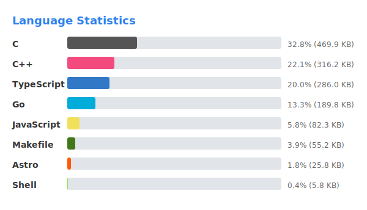

# go-readme-stats

Github上のリポジトリの言語統計をSVGとして自動生成するCLIツール



## Quick Start

```sh
export GITHUB_TOKEN=ghp_xxxx...
go run ./cmd/main.go -i=Go,TypeScript,JavaScript,C,C++
```

## Usage

```
go run ./cmd/main.go [OPTIONS]

OPTIONS:
  -i, --include  表示対象とする言語(カンマ区切り、未指定なら全言語)
  -h, --help     ヘルプを表示
```

## Features

- Github GraphQL APIで情報を取得
- SVG形式で出力
