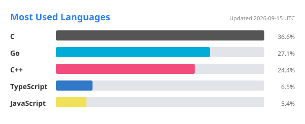

# go-readme-stats

Github上のリポジトリの言語統計をSVGとして自動生成するCLIツール



## Quick Start

```sh
export GITHUB_TOKEN=ghp_xxxx...
go run ./cmd/main.go -i=Go,TypeScript,JavaScript,C,C++
```

## Usage

```
go run ./cmd/main.go [OPTIONS]

OPTIONS:
  -i, --include       表示対象とする言語(カンマ区切り、未指定なら全言語)
  -r, --role          集計対象とするリポジトリとの関係(カンマ区切り、未指定なら OWNER)
                        OWNER:               自分が所有するリポジトリ
                        ORGANIZATION_MEMBER: 所属するOrganizationのリポジトリ
                        COLLABORATOR:        コラボレーターとして参加しているリポジトリ
  -e, --exclude-repo  集計から除外するリポジトリ(カンマ区切り、"name" または "owner/name")
  --size-weight       指標におけるバイト数の重み(デフォルト 0.5)
  --count-weight      指標におけるリポジトリ数の重み(デフォルト 0.5)
  -v, --verbose       リポジトリごとの内訳を表示(集計値の確認用)
  -h, --help          ヘルプを表示
```

## Features

- Github GraphQL APIで情報を取得
- SVG形式で出力
